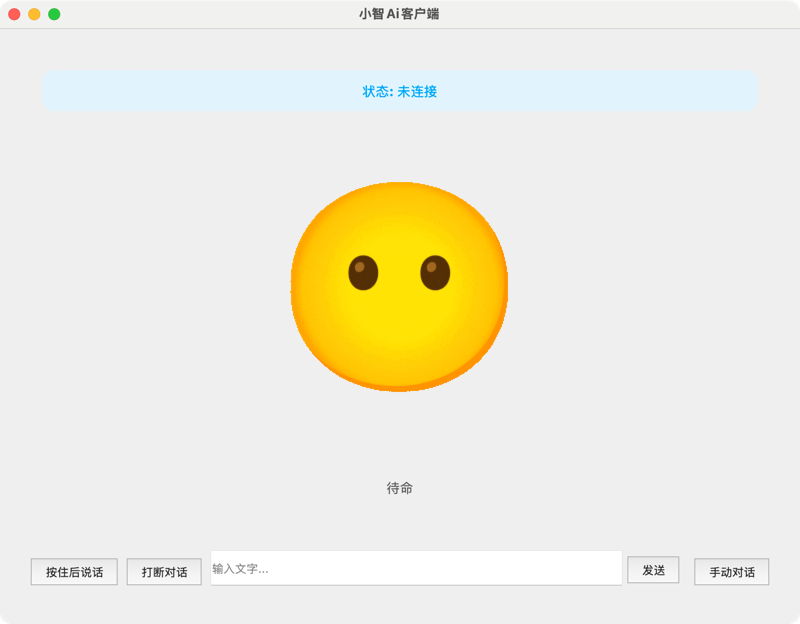

# py-xiaozhi

<p align="center" class="trendshift">
  <a href="https://trendshift.io/repositories/14130" target="_blank">
    
  </a>
</p>
<p align="center">
  <a href="https://github.com/huangjunsen0406/py-xiaozhi/releases/latest">
    
  </a>
  <a href="https://opensource.org/licenses/MIT">
    
  </a>
  <a href="https://github.com/huangjunsen0406/py-xiaozhi/stargazers">
    
  </a>
  <a href="https://github.com/huangjunsen0406/py-xiaozhi/releases/latest">
    
  </a>
  <a href="https://gitee.com/huang-jun-sen/py-xiaozhi">
    
  </a>
  <a href="https://huangjunsen0406.github.io/py-xiaozhi/guide/00_%E6%96%87%E6%A1%A3%E7%9B%AE%E5%BD%95.html">
    
  </a>
</p>

English | [简体中文](README.md)

## Project Introduction

py-xiaozhi is a Python-based Xiaozhi voice client, designed to learn coding and experience AI voice interaction without hardware requirements. This repository is ported from [xiaozhi-esp32](https://github.com/78/xiaozhi-esp32).

## Demo

- [Bilibili Demo Video](https://www.bilibili.com/video/BV1HmPjeSED2/#reply255921347937)



## Features

### 🎯 Core AI Capabilities

- **AI Voice Interaction**: Supports voice input and recognition, enabling intelligent human-computer interaction with natural conversation flow
- **Visual Multimodal**: Supports image recognition and processing, providing multimodal interaction capabilities and image content understanding
- **Intelligent Wake-up**: Supports multiple wake word activation for hands-free interaction (configurable)
- **Continuous Dialogue Mode**: Implements seamless conversation experience, enhancing user interaction fluidity

### 🔧 MCP Tools Ecosystem

- **System Control Tools**: System status monitoring, application management, volume control, device management
- **Calendar Management Tools**: Full-featured calendar system with create, query, update, delete events, intelligent categorization and reminders
- **Timer Tools**: Countdown timer functionality with delayed MCP tool execution and parallel task management
- **Music Player Tools**: Online music search and playback with playback controls, lyrics display, and local cache management
- **12306 Query Tools**: 12306 railway ticket query with train tickets, transfer queries, and route information
- **Search Tools**: Web search and content retrieval with Bing search integration and intelligent content parsing
- **Recipe Tools**: Rich recipe database with search, category browsing, and intelligent recommendations
- **Map Tools**: Amap services with geocoding, route planning, nearby search, and weather queries
- **Bazi Fortune Tools**: Traditional Chinese fortune-telling with Bazi calculation, marriage analysis, and lunar calendar queries
- **Camera Tools**: Image capture and AI analysis with photo recognition and intelligent Q&A

### 🏠 IoT Device Integration

- **Device Management Architecture**: Unified device management based on Thing pattern with asynchronous property and method calls
- **Smart Home Control**: Supports lighting, volume, temperature sensors, and other device control
- **State Synchronization**: Real-time status monitoring with incremental updates and concurrent state retrieval
- **Extensible Design**: Modular device drivers, easy to add new device types

### 🎵 Advanced Audio Processing

- **Multi-level Audio Processing**: Supports Opus codec and real-time resampling
- **Voice Activity Detection**: VAD detector for intelligent interruption with real-time voice activity monitoring
- **Wake Word Detection**: Sherpa-ONNX-based offline speech recognition with multiple wake words and pinyin matching
- **Audio Stream Management**: Independent input/output streams with stream rebuild and error recovery
- **Audio Echo Cancellation**: Integrated WebRTC audio processing module providing high-quality echo cancellation
- **System Audio Recording**: Supports system audio recording with audio loopback processing

### 🖥️ User Interface

- **Graphical Interface**: Modern PyQt5-based GUI with Xiaozhi expressions and text display for enhanced visual experience
- **Command Line Mode**: CLI support suitable for embedded devices or GUI-less environments
- **System Tray**: Background operation support with integrated system tray functionality
- **Global Hotkeys**: Global hotkey support for improved usability
- **Settings Interface**: Complete settings management interface with configuration customization

### 🔒 Security & Stability

- **Encrypted Audio Transmission**: WSS protocol support ensuring audio data security and preventing information leakage
- **Device Activation System**: Dual v1/v2 protocol activation with automatic verification code and device fingerprint handling
- **Error Recovery**: Complete error handling and recovery mechanisms with reconnection support

### 🌐 Cross-platform Support

- **System Compatibility**: Compatible with Windows 10+, macOS 10.15+, and Linux systems
- **Protocol Support**: WebSocket and MQTT dual protocol communication support
- **Multi-environment Deployment**: GUI and CLI dual modes adapting to different deployment environments
- **Platform Optimization**: Audio and system control optimization for different platforms

### 🔧 Developer Friendly

- **Modular Architecture**: Clean code structure with clear responsibility separation for secondary development
- **Async First**: Event-driven architecture based on asyncio for high-performance concurrent processing
- **Configuration Management**: Hierarchical configuration system with dot notation access and dynamic updates
- **Logging System**: Complete logging and debugging support
- **API Documentation**: Detailed code documentation and usage guides

## System Requirements

### Basic Requirements

- **Python Version**: 3.9 - 3.12
- **Operating System**: Windows 10+, macOS 10.15+, Linux
- **Audio Devices**: Microphone and speaker devices
- **Network Connection**: Stable internet connection (for AI services and online features)

### Recommended Configuration

- **Memory**: At least 4GB RAM (8GB+ recommended)
- **Processor**: Modern CPU with AVX instruction set support
- **Storage**: At least 2GB available disk space (for model files and cache)
- **Audio**: Audio devices supporting 16kHz sampling rate

### Optional Feature Requirements

- **Voice Wake-up**: Requires downloading Sherpa-ONNX speech recognition models
- **Camera Features**: Requires camera device and OpenCV support

## Read This First

- Carefully read [项目文档](https://huangjunsen0406.github.io/py-xiaozhi/) for startup tutorials and file descriptions
- The main branch has the latest code; manually reinstall pip dependencies after each update to ensure you have new dependencies

[Zero to Xiaozhi Client (Video Tutorial)](https://www.bilibili.com/video/BV1dWQhYEEmq/?vd_source=2065ec11f7577e7107a55bbdc3d12fce)

## Technical Architecture

### Core Architecture Design

- **Event-Driven Architecture**: Based on asyncio asynchronous event loop, supporting high-concurrency processing
- **Layered Design**: Clear separation of application layer, protocol layer, device layer, and UI layer
- **Singleton Pattern**: Core components use singleton pattern to ensure unified resource management
- **Plugin System**: MCP tool system and IoT devices support plugin-based extension

### Key Technical Components

- **Audio Processing**: Opus codec, WebRTC echo cancellation, real-time resampling, system audio recording
- **Speech Recognition**: Sherpa-ONNX offline models, voice activity detection, wake word recognition
- **Protocol Communication**: WebSocket/MQTT dual protocol support, encrypted transmission, auto-reconnection
- **Configuration System**: Hierarchical configuration, dot notation access, dynamic updates, JSON/YAML support

### Performance Optimization

- **Async First**: Full system asynchronous architecture, avoiding blocking operations
- **Memory Management**: Smart caching, garbage collection
- **Audio Optimization**: 5ms low-latency processing, queue management, streaming transmission
- **Concurrency Control**: Task pool management, semaphore control, thread safety

### Security Mechanisms

- **Encrypted Communication**: WSS/TLS encryption, certificate verification
- **Device Authentication**: Dual protocol activation, device fingerprint recognition
- **Access Control**: Tool permission management, API access control
- **Error Isolation**: Exception isolation, fault recovery, graceful degradation

## Development Guide

### Project Structure

```
py-xiaozhi/
├── main.py                     # Application main entry (CLI argument handling)
├── src/
│   ├── application.py          # Application core logic
│   ├── audio_codecs/           # Audio codecs
│   │   ├── aec_processor.py    # Audio echo cancellation processor
│   │   ├── audio_codec.py      # Audio codec base class
│   │   └── system_audio_recorder.py  # System audio recorder
│   ├── audio_processing/       # Audio processing modules
│   │   ├── vad_detector.py     # Voice activity detection
│   │   └── wake_word_detect.py # Wake word detection
│   ├── core/                   # Core components
│   │   ├── ota.py             # Over-the-air update module
│   │   └── system_initializer.py # System initializer
│   ├── display/                # Display interface abstraction layer
│   ├── iot/                    # IoT device management
│   │   ├── thing.py           # Device base class
│   │   ├── thing_manager.py   # Device manager
│   │   └── things/            # Concrete device implementations
│   ├── mcp/                    # MCP tool system
│   │   ├── mcp_server.py      # MCP server
│   │   └── tools/             # Various tool modules
│   ├── protocols/              # Communication protocols
│   ├── utils/                  # Utility functions
│   └── views/                  # UI view components
├── libs/                       # Third-party native libraries
│   ├── libopus/               # Opus audio codec library
│   ├── webrtc_apm/            # WebRTC audio processing module
│   └── SystemAudioRecorder/   # System audio recording tool
├── config/                     # Configuration file directory
├── models/                     # Speech model files
├── assets/                     # Static resource files
├── scripts/                    # Auxiliary scripts
├── requirements.txt            # Python dependency package list
└── build.json                  # Build configuration file
```

### Development Environment Setup

```bash
# Clone project
git clone https://github.com/huangjunsen0406/py-xiaozhi.git
cd py-xiaozhi

# Install dependencies
pip install -r requirements.txt

# Code formatting
./format_code.sh

# Run program - GUI mode (default)
python main.py

# Run program - CLI mode
python main.py --mode cli

# Specify communication protocol
python main.py --protocol websocket  # WebSocket (default)
python main.py --protocol mqtt       # MQTT protocol
```

### Core Development Patterns

- **Async First**: Use `async/await` syntax, avoid blocking operations
- **Error Handling**: Complete exception handling and logging
- **Configuration Management**: Use `ConfigManager` for unified configuration access
- **Test-Driven**: Write unit tests to ensure code quality

### Extension Development

- **Add MCP Tools**: Create new tool modules in `src/mcp/tools/` directory
- **Add IoT Devices**: Inherit from `Thing` base class to implement new devices
- **Add Protocols**: Implement `Protocol` abstract base class
- **Add Interfaces**: Extend `BaseDisplay` to implement new UI components

### State Transition Diagram

```
                        +----------------+
                        |                |
                        v                |
+------+  Wake/Button  +------------+   |   +------------+
| IDLE | -----------> | CONNECTING | --+-> | LISTENING  |
+------+              +------------+       +------------+
   ^                                            |
   |                                            | Voice Recognition Complete
   |          +------------+                    v
   +--------- |  SPEAKING  | <-----------------+
     Playback +------------+
     Complete
```

## Contribution Guidelines

We welcome issue reports and code contributions. Please ensure you follow these specifications:

1. Code style complies with PEP8 standards
2. PR submissions include appropriate tests
3. Update relevant documentation

## Community and Support

### Thanks to the Following Open Source Contributors
>
> In no particular order

[Xiaoxia](https://github.com/78)
[zhh827](https://github.com/zhh827)
[SmartArduino-Li Honggang](https://github.com/SmartArduino)
[HonestQiao](https://github.com/HonestQiao)
[vonweller](https://github.com/vonweller)
[Sun Weigong](https://space.bilibili.com/416954647)
[isamu2025](https://github.com/isamu2025)
[Rain120](https://github.com/Rain120)
[kejily](https://github.com/kejily)
[Radio bilibili Jun](https://space.bilibili.com/119751)
[Cyber Intelligence](https://shop115087494.m.taobao.com/?refer=https%3A%2F%2Fm.tb.cn%2F&ut_sk=1.WMelxbgDQWkDAJ1Rq9Pn7DCD_21380790_1757337352472.Copy.shop&suid=0E25E948-651D-46E0-8E89-5C8CB03B4F56&shop_navi=shopindex&sourceType=shop&shareUniqueId=33038752403&un=d22c5ceda82844ab8bd7bab98ffeb263&share_crt_v=1&un_site=0&spm=a2159r.13376460.0.0&sp_tk=dkRKUjRKUWo2ZHY%3D&bc_fl_src=share-1041250486811064-2-1&cpp=1&shareurl=true&short_name=h.SaBKVHytsCKIPNS&bxsign=scdGtSe264e_qkFQBh0rXCkF-Mrb_s6t35EnpVBBU5dsrd-J24c-_rn_PhJiXRk0hg2hjGoAm0L7j2UQg27OIH_6gZkbhKDyLziD2cy4pDf8sC3KmqrF55TXP3USZaPTw_-&app=weixin)

### Sponsorship Support

<div align="center">
  <h3>Thanks to All Sponsors ❤️</h3>
  <p>Whether it's API resources, device compatibility testing, or financial support, every contribution makes the project more complete</p>
  
  <a href="https://huangjunsen0406.github.io/py-xiaozhi/sponsors/" target="_blank">
    
  </a>
  <a href="https://huangjunsen0406.github.io/py-xiaozhi/sponsors/" target="_blank">
    
  </a>
</div>

## Project Statistics

[](https://www.star-history.com/#huangjunsen0406/py-xiaozhi&Date)

## License

[MIT License](LICENSE)
