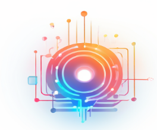

# IntelliConnect

<div class="project-header">
  <div class="project-logo">
    
  </div>
  <div class="project-badges">
    <span class="badge platform">跨平台</span>
    <span class="badge language">Java/Spring</span>
    <span class="badge status">v0.1</span>
  </div>
</div>

<div class="ascii-art">
<pre>
██╗ ███╗   ██╗ ████████╗ ███████╗ ██╗      ██╗      ██╗    ██████╗  ██████╗  ███╗   ██╗ ███╗   ██╗ ███████╗  ██████╗ ████████╗
██║ ████╗  ██║ ╚══██╔══╝ ██╔════╝ ██║      ██║      ██║   ██╔════╝ ██╔═══██╗ ████╗  ██║ ████╗  ██║ ██╔════╝ ██╔════╝ ╚══██╔══╝
██║ ██╔██╗ ██║    ██║    █████╗   ██║      ██║      ██║   ██║      ██║   ██║ ██╔██╗ ██║ ██╔██╗ ██║ █████╗   ██║         ██║   
██║ ██║╚██╗██║    ██║    ██╔══╝   ██║      ██║      ██║   ██║      ██║   ██║ ██║╚██╗██║ ██║╚██╗██║ ██╔══╝   ██║         ██║   
██║ ██║ ╚████║    ██║    ███████╗ ███████╗ ███████╗ ██║   ╚██████╗ ╚██████╔╝ ██║ ╚████║ ██║ ╚████║ ███████╗ ╚██████╗    ██║   
╚═╝ ╚═╝  ╚═══╝    ╚═╝    ╚══════╝ ╚══════╝ ╚══════╝ ╚═╝    ╚═════╝  ╚═════╝  ╚═╝  ╚═══╝ ╚═╝  ╚═══╝ ╚══════╝  ╚═════╝    ╚═╝   
</pre>
<p class="ascii-caption">Built by RSLLY</p>
</div>

<div class="project-badges-center">
  
  
  
</div>

## 概述

* 本项目基于springboot2.7开发，使用spring security作为安全框架
* 配备物模型(属性，功能和事件模块)和完善的监控模块
* 支持多种大模型和先进的Agent智能体技术提供出色的AI智能，可以快速搭建智能物联网应用(首个基于Agent智能体设计的物联网平台)
* 支持快速构建智能语音应用，支持语音识别和语音合成
* 支持多种iot协议，使用emqx exhook作为mqtt通讯，可扩展性强
* 支持OTA空中升级技术
* 支持微信小程序和微信服务号
* 支持小智AI硬件
* 使用常见的mysql和redis数据库，上手简单
* 支持时序数据库influxdb

## 安装运行

<div class="notice">
  <p>推荐使用docker安装，docker-compose.yaml文件在docker目录下，执行 docker-compose up 可初始化mysql,redis,emqx和influxdb环境，安装详情请看官方文档。</p>
</div>

* 安装mysql和redis数据库，高性能运行推荐安装时序数据库influxdb
* 安装EMQX集群,并配置好exhook，本项目使用exhook作为mqtt消息的处理器
* 安装java17环境
* 修改配置文件application.yaml(设置ddl-auto为update模式)
* java -jar IntelliConnect-1.8-SNAPSHOT.jar

```bash
# 克隆仓库
git clone https://github.com/ruanrongman/IntelliConnect
cd intelliconnect/docker

# 启动所需环境（MySQL, Redis, EMQX, InfluxDB）
docker-compose up -d
```

## 项目特色

* 极简主义，层次分明，符合mvc分层结构
* 完善的物模型抽象，使得iot开发者可以专注于业务本身
* AI能力丰富，支持Agent智能体技术，快速开发AI智能应用

## 小智 ESP-32 后端服务(xiaozhi-esp32-server)

<div class="esp32-section">
  <p>本项目能够为开源智能硬件项目 <a href="https://github.com/78/xiaozhi-esp32" target="_blank">xiaozhi-esp32</a> 提供后端服务。根据 <a href="https://ccnphfhqs21z.feishu.cn/wiki/M0XiwldO9iJwHikpXD5cEx71nKh" target="_blank">小智通信协议</a> 使用 <code>Java</code> 实现。</p>
  <p>适合希望本地部署的用户，不同于单纯语音交互，本项目重点在于提供更强大的物联网和智能体能力。</p>
</div>

## 项目文档和视频演示

* 项目文档和视频演示地址：[https://ruanrongman.github.io/IntelliConnect/](https://ruanrongman.github.io/IntelliConnect/)
* 技术博客地址：[https://wordpress.rslly.top](https://wordpress.rslly.top)
* 社区地址：[https://github.com/cwliot](https://github.com/cwliot)
* 创万联社区公众号：微信直接搜索创万联

## 相关项目和社区

* **创万联(cwl)**: 专注于物联网和人工智能技术的开源社区。
* **Promptulate**: [https://github.com/Undertone0809/promptulate](https://github.com/Undertone0809/promptulate) - A LLM application and Agent development framework.
* **Rymcu**: [https://github.com/rymcu](https://github.com/rymcu) - 为数百万人服务的开源嵌入式知识学习交流平台

## 致谢

* 感谢项目[xiaozhi-esp32](https://github.com/78/xiaozhi-esp32)提供强大的硬件语音交互。
* 感谢项目[Concentus: Opus for Everyone](https://github.com/lostromb/concentus)提供opus解码和编码。
* 感谢项目[TalkX](https://github.com/big-mouth-cn/talkx)提供了opus解码和编码的参考。
* 感谢项目[py-xiaozhi](https://github.com/huangjunsen0406/py-xiaozhi)方便项目进行小智开发调试。

## 贡献

本人正在尝试一些更加完善的抽象模式，支持更多的物联网协议和数据存储形式，如果你有更好的建议，欢迎一起讨论交流。

<style>
.project-header {
  display: flex;
  align-items: center;
  margin-bottom: 2rem;
}

.project-logo {
  width: 120px;
  height: 120px;
  margin-right: 1.5rem;
}

.project-logo img {
  width: 100%;
  height: 100%;
  object-fit: contain;
}

.project-badges {
  display: flex;
  flex-wrap: wrap;
  gap: 0.5rem;
}

.badge {
  display: inline-block;
  padding: 0.25rem 0.75rem;
  border-radius: 1rem;
  font-size: 0.85rem;
  font-weight: 500;
}

.badge.platform {
  background-color: var(--vp-c-brand-soft);
  color: var(--vp-c-brand-dark);
}

.badge.language {
  background-color: rgba(59, 130, 246, 0.2);
  color: rgb(59, 130, 246);
}

.badge.status {
  background-color: rgba(234, 179, 8, 0.2);
  color: rgb(234, 179, 8);
}

.ascii-art {
  overflow-x: auto;
  margin: 2rem 0;
  text-align: center;
}

.ascii-art pre {
  display: inline-block;
  text-align: left;
  font-size: 0.6rem;
  line-height: 1;
  white-space: pre;
  margin: 0;
  background: transparent;
  color: var(--vp-c-brand);
  font-family: monospace;
}

.ascii-caption {
  font-size: 0.8rem;
  margin-top: 0.5rem;
  color: var(--vp-c-text-2);
}

.project-badges-center {
  display: flex;
  justify-content: center;
  flex-wrap: wrap;
  gap: 0.5rem;
  margin-bottom: 2rem;
}

.notice {
  background-color: var(--vp-c-bg-soft);
  border-left: 4px solid var(--vp-c-brand);
  padding: 1rem 1.5rem;
  margin: 1.5rem 0;
  border-radius: 0 8px 8px 0;
}

.esp32-section {
  background-color: var(--vp-c-bg-soft);
  border-radius: 8px;
  padding: 1.5rem;
  margin: 1.5rem 0;
  border: 1px solid var(--vp-c-divider);
}

.qr-container {
  text-align: center;
  margin: 2rem 0;
}

.qr-code {
  width: 250px;
  height: auto;
  object-fit: contain;
  border-radius: 8px;
  border: 1px solid var(--vp-c-divider);
}

@media (max-width: 768px) {
  .ascii-art pre {
    font-size: 0.4rem;
  }
  
  .project-header {
    flex-direction: column;
    align-items: flex-start;
  }
  
  .project-logo {
    margin-bottom: 1rem;
  }
}

@media (max-width: 480px) {
  .ascii-art {
    display: none;
  }
}
</style> 