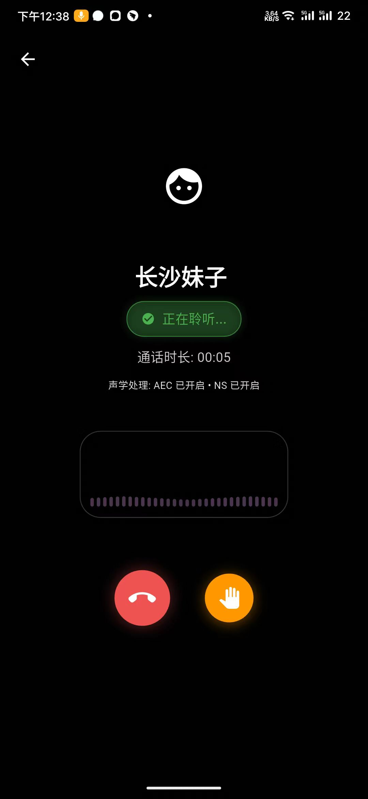
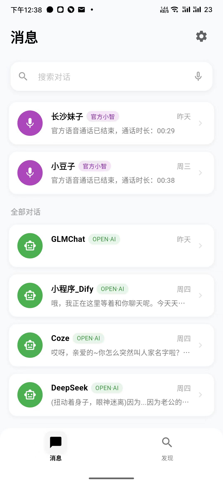

# 小智手机客户端

<div class="project-header">
  <div class="project-logo">
    
  </div>
  <div class="project-badges">
    <span class="badge platform">多平台</span>
    <span class="badge language">Flutter/Dart</span>
    <span class="badge status">活跃开发中</span>
  </div>
</div>

## 项目简介

小智手机客户端是基于Flutter框架开发的跨平台应用，为小智AI生态系统提供了移动端接入能力。通过一套代码，实现了在iOS、Android、Web、Windows、macOS和Linux等多个平台的部署，让用户随时随地都能与小智AI进行实时语音交互和文字对话。

<div class="app-showcase">
  <div class="showcase-image">
    
    <div class="overlay">
      <a href="https://www.bilibili.com/video/BV1fgXvYqE61" target="_blank" class="watch-demo">观看演示视频</a>
    </div>
  </div>
  <div class="showcase-description">
    <p>最新版本客户端已全面升级，支持iOS与Android平台，并可自行打包为Web、PC版本。通过精心设计的UI和流畅的交互体验，为用户提供随时随地与小智AI交流的能力。</p>
  </div>
</div>

## 核心功能

<div class="features-grid">
  <div class="feature-card">
    <div class="feature-icon">📱</div>
    <h3>跨平台支持</h3>
    <p>使用Flutter开发，一套代码支持iOS、Android、Web、Windows、macOS和Linux等多平台</p>
  </div>
  
  <div class="feature-card">
    <div class="feature-icon">🤖</div>
    <h3>多AI模型集成</h3>
    <p>支持小智AI服务、Dify、OpenAI等多种AI服务，可随时切换不同模型</p>
  </div>
  
  <div class="feature-card">
    <div class="feature-icon">💬</div>
    <h3>丰富交互方式</h3>
    <p>支持实时语音对话、文字消息、图片消息，以及通话中手动打断功能</p>
  </div>
  
  <div class="feature-card">
    <div class="feature-icon">🔊</div>
    <h3>语音优化技术</h3>
    <p>实现安卓设备AEC+NS回音消除，提升语音交互质量</p>
  </div>
  
  <div class="feature-card">
    <div class="feature-icon">🎨</div>
    <h3>精美界面设计</h3>
    <p>轻度拟物化设计、流畅动画效果、自适应UI布局</p>
  </div>
  
  <div class="feature-card">
    <div class="feature-icon">⚙️</div>
    <h3>灵活配置选项</h3>
    <p>支持多种AI服务配置管理，可添加多个小智到聊天列表</p>
  </div>
</div>

## 功能亮点

### 实时语音交互

<div class="feature-highlight">
  <div class="highlight-image">
    
  </div>
  <div class="highlight-content">
    <h3>流畅的语音对话体验</h3>
    <ul>
      <li>实时语音识别和响应</li>
      <li>支持持续对话模式</li>
      <li>语音交互过程中支持手动打断</li>
      <li>按住说话快捷模式</li>
      <li>语音会话历史记录</li>
    </ul>
  </div>
</div>

### 多AI服务支持

<div class="feature-highlight reverse">
  <div class="highlight-content">
    <h3>灵活切换不同AI服务</h3>
    <ul>
      <li>集成小智WebSocket实时语音对话</li>
      <li>支持Dify平台接入</li>
      <li>支持OpenAI图文消息和流式输出</li>
      <li>支持官方小智服务一键设备注册</li>
      <li>可同时添加多个AI服务到对话列表</li>
    </ul>
  </div>
  <div class="highlight-image">
    
  </div>
</div>

## 系统要求

- **Flutter**: ^3.7.0
- **Dart**: ^3.7.0
- **iOS**: 12.0+
- **Android**: API 21+ (Android 5.0+)
- **Web**: 现代浏览器

## 安装与使用

### 安装方法

1. 克隆项目仓库:
```bash
git clone https://github.com/TOM88812/xiaozhi-android-client.git
```

2. 安装依赖:
```bash
flutter pub get
```

3. 运行应用:
```bash
flutter run
```

### 构建发布版本

```bash
# Android应用
flutter build apk --release

# iOS应用
flutter build ios --release

# Web应用
flutter build web --release
```

> **注意**: iOS编译完成后，需要在设置-APP中打开网络权限

## 配置说明

应用支持灵活的服务配置管理，包括：

### 小智服务配置
- 支持配置多个小智服务地址
- WebSocket URL设置
- Token认证
- 自定义MAC地址

### Dify API配置
- 支持配置多个Dify服务
- API密钥管理
- 服务器URL配置

### OpenAI配置
- API密钥设置
- 模型选择
- 参数调整

## 开发计划

<div class="roadmap">
  <div class="roadmap-item done">
    <div class="status-dot"></div>
    <div class="item-content">
      <h4>已实现功能</h4>
      <ul>
        <li>支持多种AI服务提供商</li>
        <li>支持OTA自动注册设备</li>
        <li>增强语音识别准确性</li>
        <li>实现文字和语音混合会话</li>
        <li>支持OpenAI接口图文交互</li>
      </ul>
    </div>
  </div>
  
  <div class="roadmap-item progress">
    <div class="status-dot"></div>
    <div class="item-content">
      <h4>正在开发</h4>
      <ul>
        <li>深色/浅色主题适配</li>
        <li>iOS平台回音消除实现</li>
        <li>本地ASR语音识别支持</li>
        <li>本地唤醒词功能</li>
      </ul>
    </div>
  </div>
  
  <div class="roadmap-item planned">
    <div class="status-dot"></div>
    <div class="item-content">
      <h4>计划实现</h4>
      <ul>
        <li>支持IoT映射手机操作</li>
        <li>本地TTS实现</li>
        <li>支持MCP_Client</li>
        <li>OpenAI接口联网搜索功能</li>
      </ul>
    </div>
  </div>
</div>

## 项目贡献

欢迎为小智手机客户端贡献代码或提交问题反馈：

- 目前iOS端回音消除尚未实现，欢迎有经验的开发者PR
- 提交Bug、功能请求或改进建议
- 分享您使用小智手机客户端的经验和案例

## 相关链接

- [项目GitHub仓库](https://github.com/TOM88812/xiaozhi-android-client)
- [演示视频](https://www.bilibili.com/video/BV1fgXvYqE61)
- [问题反馈](https://github.com/TOM88812/xiaozhi-android-client/issues)

<style>
.project-header {
  display: flex;
  align-items: center;
  margin-bottom: 2rem;
}

.project-logo {
  width: 100px;
  height: 100px;
  margin-right: 1.5rem;
}

.project-logo img {
  width: 100%;
  height: 100%;
  object-fit: contain;
}

.project-badges {
  display: flex;
  flex-wrap: wrap;
  gap: 0.5rem;
}

.badge {
  display: inline-block;
  padding: 0.25rem 0.75rem;
  border-radius: 1rem;
  font-size: 0.85rem;
  font-weight: 500;
}

.badge.platform {
  background-color: var(--vp-c-brand-soft);
  color: var(--vp-c-brand-dark);
}

.badge.language {
  background-color: rgba(59, 130, 246, 0.2);
  color: rgb(59, 130, 246);
}

.badge.status {
  background-color: rgba(16, 185, 129, 0.2);
  color: rgb(16, 185, 129);
}

.app-showcase {
  margin: 2rem 0;
  background-color: var(--vp-c-bg-soft);
  border-radius: 12px;
  overflow: hidden;
  border: 1px solid var(--vp-c-divider);
}

.showcase-image {
  position: relative;
  width: 100%;
  height: 300px;
}

.showcase-image img {
  width: 100%;
  height: 100%;
  object-fit: cover;
}

.overlay {
  position: absolute;
  top: 0;
  left: 0;
  width: 100%;
  height: 100%;
  background: rgba(0, 0, 0, 0.3);
  display: flex;
  align-items: center;
  justify-content: center;
  opacity: 0;
  transition: opacity 0.3s ease;
}

.showcase-image:hover .overlay {
  opacity: 1;
}

.watch-demo {
  padding: 0.75rem 1.5rem;
  /*background-color: var(--vp-c-brand);*/
  color: white;
  border-radius: 4px;
  text-decoration: none;
  font-weight: 500;
  transition: background-color 0.1s ease;
}

.watch-demo:hover {
  background-color: var(--vp-c-brand-dark);
}

.showcase-description {
  padding: 1.5rem;
  font-size: 1.1rem;
  line-height: 1.6;
}

.features-grid {
  display: grid;
  grid-template-columns: repeat(auto-fill, minmax(280px, 1fr));
  gap: 1.5rem;
  margin: 2rem 0;
}

.feature-card {
  background-color: var(--vp-c-bg-soft);
  border-radius: 8px;
  padding: 1.5rem;
  transition: transform 0.3s ease, box-shadow 0.3s ease;
  border: 1px solid var(--vp-c-divider);
  height: 100%;
}

.feature-card:hover {
  transform: translateY(-5px);
  box-shadow: 0 5px 15px rgba(0, 0, 0, 0.1);
}

.feature-icon {
  font-size: 2rem;
  margin-bottom: 1rem;
}

.feature-card h3 {
  color: var(--vp-c-brand);
  margin-top: 0;
  margin-bottom: 0.5rem;
}

.feature-highlight {
  display: flex;
  margin: 3rem 0;
  background-color: var(--vp-c-bg-soft);
  border-radius: 12px;
  overflow: hidden;
  border: 1px solid var(--vp-c-divider);
}

.feature-highlight.reverse {
  flex-direction: row-reverse;
}

.highlight-image {
  flex: 1;
  min-width: 40%;
}

.highlight-image img {
  width: 100%;
  height: 100%;
  object-fit: cover;
}

.highlight-content {
  flex: 1;
  padding: 2rem;
}

.highlight-content h3 {
  color: var(--vp-c-brand);
  margin-top: 0;
  margin-bottom: 1rem;
}

.highlight-content ul {
  padding-left: 1.5rem;
}

.highlight-content li {
  margin-bottom: 0.5rem;
}

.roadmap {
  position: relative;
  margin: 3rem 0;
  padding-left: 2rem;
}

.roadmap:before {
  content: "";
  position: absolute;
  left: 7px;
  top: 0;
  bottom: 0;
  width: 2px;
  background-color: var(--vp-c-divider);
}

.roadmap-item {
  position: relative;
  margin-bottom: 2rem;
}

.status-dot {
  position: absolute;
  left: -2rem;
  top: 0;
  width: 16px;
  height: 16px;
  border-radius: 50%;
  z-index: 1;
}

.roadmap-item.done .status-dot {
  background-color: rgb(16, 185, 129);
}

.roadmap-item.progress .status-dot {
  background-color: rgb(245, 158, 11);
}

.roadmap-item.planned .status-dot {
  background-color: rgb(99, 102, 241);
}

.item-content {
  background-color: var(--vp-c-bg-soft);
  border-radius: 8px;
  padding: 1.5rem;
  border: 1px solid var(--vp-c-divider);
}

.item-content h4 {
  margin-top: 0;
  margin-bottom: 1rem;
}

.roadmap-item.done h4 {
  color: rgb(16, 185, 129);
}

.roadmap-item.progress h4 {
  color: rgb(245, 158, 11);
}

.roadmap-item.planned h4 {
  color: rgb(99, 102, 241);
}

@media (max-width: 768px) {
  .feature-highlight, 
  .feature-highlight.reverse {
    flex-direction: column;
  }
  
  .highlight-image {
    height: 200px;
  }
  
  .project-header {
    flex-direction: column;
    align-items: flex-start;
  }
  
  .project-logo {
    margin-bottom: 1rem;
  }
}
</style> 