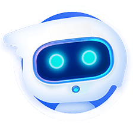

# xiaozhi-esp32-server

  

    
  

  

    ESP32
    Python
    活跃开发中
  

  
xiaozhi-esp32-server是为开源智能硬件项目<a href="https://github.com/78/xiaozhi-esp32" target="_blank">xiaozhi-esp32</a>提供的后端服务，根据<a href="https://ccnphfhqs21z.feishu.cn/wiki/M0XiwldO9iJwHikpXD5cEx71nKh" target="_blank">小智通信协议</a>使用Python实现，帮助您快速搭建小智服务器。

## 适用人群

本项目需要配合ESP32硬件设备使用。如果您已经购买了ESP32相关硬件，且成功对接过虾哥部署的后端服务，并希望独立搭建自己的`xiaozhi-esp32`后端服务，那么本项目非常适合您。

  <h3>⚠️ 重要提示</h3>
  <ol>
    <li>本项目为开源软件，与对接的任何第三方API服务商（包括但不限于语音识别、大模型、语音合成等平台）均不存在商业合作关系，不为其服务质量及资金安全提供任何形式的担保。建议使用者优先选择持有相关业务牌照的服务商，并仔细阅读其服务协议及隐私政策。本软件不托管任何账户密钥、不参与资金流转、不承担充值资金损失风险。</li>
    <li>本项目成立时间较短，还未通过网络安全测评，请勿在生产环境中使用。如果您在公网环境中部署学习本项目，请务必在配置文件<code>config.yaml</code>中开启防护。</li>
  </ol>

## 核心特性

  

    
🔄

    <h3>通信协议</h3>
    
基于<code>xiaozhi-esp32</code>协议，通过WebSocket实现数据交互

  

  
  

    
💬

    <h3>对话交互</h3>
    
支持唤醒对话、手动对话及实时打断，长时间无对话时自动休眠

  

  
  

    
🧠

    <h3>意图识别</h3>
    
支持使用LLM意图识别、function call函数调用，减少硬编码意图判断

  

  
  

    
🌐

    <h3>多语言识别</h3>
    
支持国语、粤语、英语、日语、韩语（默认使用FunASR）

  

  
  

    
🤖

    <h3>LLM模块</h3>
    
支持灵活切换LLM模块，默认使用ChatGLMLLM，也可选用阿里百炼、DeepSeek、Ollama等

  

  
  

    
🔊

    <h3>TTS模块</h3>
    
支持EdgeTTS（默认）、火山引擎豆包TTS等多种TTS接口，满足语音合成需求

  

  
  

    
📝

    <h3>记忆功能</h3>
    
支持超长记忆、本地总结记忆、无记忆三种模式，满足不同场景需求

  

  
  

    
🏠

    <h3>IOT功能</h3>
    
支持管理注册设备IOT功能，支持基于对话上下文语境下的智能物联网控制

  

  
  

    
🖥️

    <h3>智控台</h3>
    
提供Web管理界面，支持智能体管理、用户管理、系统配置等功能

  

## 部署方式

本项目提供两种部署方式，请根据您的具体需求选择：

  <table>
    <thead>
      <tr>
        <th>部署方式</th>
        <th>特点</th>
        <th>适用场景</th>
      </tr>
    </thead>
    <tbody>
      <tr>
        <td><strong>最简化安装</strong></td>
        <td>智能对话、IOT功能，数据存储在配置文件</td>
        <td>低配置环境，无需数据库</td>
      </tr>
      <tr>
        <td><strong>全模块安装</strong></td>
        <td>智能对话、IOT、OTA、智控台，数据存储在数据库</td>
        <td>完整功能体验</td>
      </tr>
    </tbody>
  </table>

详细部署文档请参考：
- [Docker部署文档](https://github.com/xinnan-tech/xiaozhi-esp32-server/blob/main/docs/Deployment.md)
- [源码部署文档](https://github.com/xinnan-tech/xiaozhi-esp32-server/blob/main/docs/Deployment_all.md)

## 支持平台列表

xiaozhi-esp32-server支持丰富的第三方平台和组件：

### LLM 语言模型

  <h4>接口调用</h4>
  
<strong>支持平台：</strong>阿里百炼、火山引擎豆包、深度求索、智谱ChatGLM、Gemini、Ollama、Dify、Fastgpt、Coze

  
<strong>免费平台：</strong>智谱ChatGLM、Gemini

  
<em>实际上，任何支持openai接口调用的LLM均可接入使用</em>

### TTS 语音合成

  <h4>接口调用</h4>
  
<strong>支持平台：</strong>EdgeTTS、火山引擎豆包TTS、腾讯云、阿里云TTS、CosyVoiceSiliconflow、TTS302AI、CozeCnTTS、GizwitsTTS、ACGNTTS、OpenAITTS

  
<strong>免费平台：</strong>EdgeTTS、CosyVoiceSiliconflow(部分)

  
  <h4>本地服务</h4>
  
<strong>支持平台：</strong>FishSpeech、GPT_SOVITS_V2、GPT_SOVITS_V3、MinimaxTTS

  
<strong>免费平台：</strong>FishSpeech、GPT_SOVITS_V2、GPT_SOVITS_V3、MinimaxTTS

### ASR 语音识别

  <h4>接口调用</h4>
  
<strong>支持平台：</strong>DoubaoASR

  
  <h4>本地服务</h4>
  
<strong>支持平台：</strong>FunASR、SherpaASR

  
<strong>免费平台：</strong>FunASR、SherpaASR

### 更多组件

- **VAD语音活动检测**：支持SileroVAD（本地免费使用）
- **记忆存储**：支持mem0ai（1000次/月额度）、mem_local_short（本地总结，免费）
- **意图识别**：支持intent_llm（通过大模型识别意图）、function_call（通过大模型函数调用完成意图）

## 参与贡献

xiaozhi-esp32-server是一个活跃的开源项目，欢迎贡献代码或提交问题反馈：

- [GitHub仓库](https://github.com/xinnan-tech/xiaozhi-esp32-server)
- [问题反馈](https://github.com/xinnan-tech/xiaozhi-esp32-server/issues)
- [致开发者的公开信](https://github.com/xinnan-tech/xiaozhi-esp32-server/blob/main/docs/contributor_open_letter.md)

 