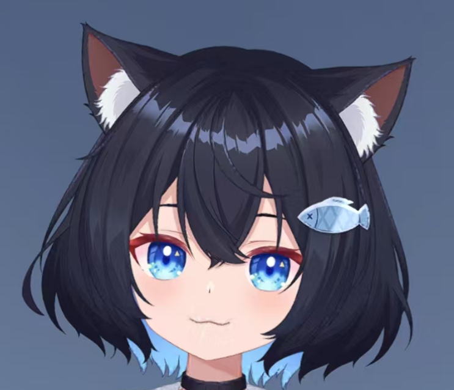
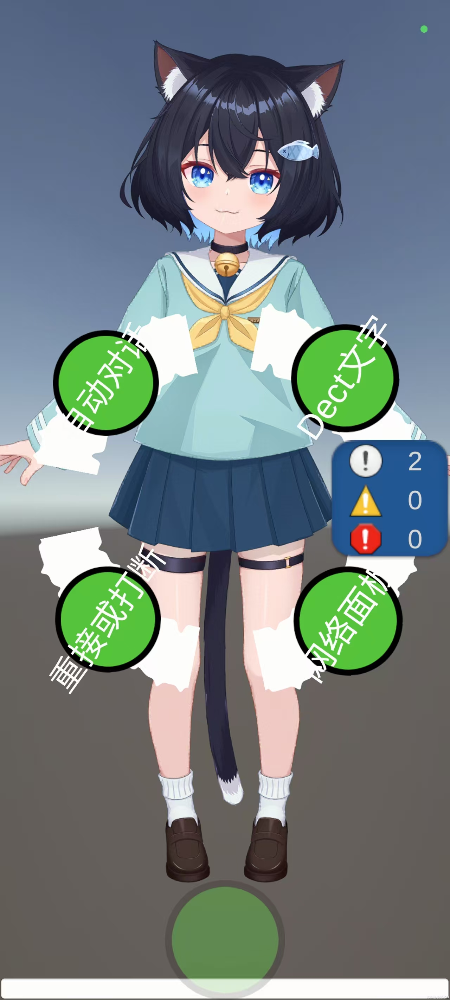
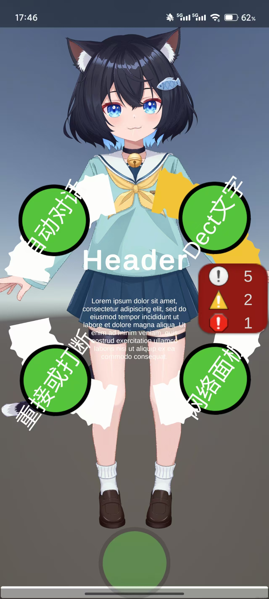

# XiaoZhiAI_server32_Unity

<div class="project-header">
  <div class="project-logo">
    
  </div>
  <div class="project-badges">
    <span class="badge platform">跨平台</span>
    <span class="badge language">C#/Unity</span>
    <span class="badge status">活跃开发中</span>
  </div>
</div>

## 项目简介

XiaoZhiAI_server32_Unity是一个基于Unity开发的AI应用程序，专注于提供高质量的语音交互和网络服务功能。本项目利用Unity的跨平台特性，支持多种设备和操作系统，包括PC、Android、iOS、WebGL和微信小程序，为用户提供流畅的AI语音与Live2D交互体验。

## 技术架构

XiaoZhiAI_server32_Unity基于以下技术栈构建：

- **开发引擎**：Unity 2020.3或更高版本
- **目标平台**：PC、Android、iOS、WebGL、微信小程序
- **核心功能模块**：
  - **语音交互系统**：实时语音识别、自然语言处理、语音合成
  - **Live2D交互**：服务端返回LLM表情交互Live2D
  - **Mqtt硬件交互**：服务端functioncall处理IoT返回

- **依赖包**：
  - OPUS解码SDK
  - WebSocket网络通信库
  - YooAsset资源管理框架2.3.7版本
  - YuikFrameWork (YOO分支)
  - Hycrl热更新框架


## 核心功能

### 语音交互能力

<div class="features-grid">
  <div class="feature-card">
    <div class="feature-icon">🎤</div>
    <h3>实时语音识别</h3>
    <p>支持多种语言的实时语音转文字，准确率高达95%以上</p>
  </div>
  
  <div class="feature-card">
    <div class="feature-icon">🧠</div>
    <h3>自然语言理解</h3>
    <p>基于深度学习的语义分析，精准理解用户意图</p>
  </div>
  
  <div class="feature-card">
    <div class="feature-icon">🔊</div>
    <h3>语音合成</h3>
    <p>自然流畅的语音输出，支持多种音色和语速调节</p>
  </div>
  
  <div class="feature-card">
    <div class="feature-icon">🤖</div>
    <h3>Live2D表情交互</h3>
    <p>根据LLM返回结果实现实时表情变化和情感表达</p>
  </div>
  
  <div class="feature-card">
    <div class="feature-icon">📱</div>
    <h3>IoT与Mqtt对接</h3>
    <p>通过functioncall实现智能家居设备控制和状态反馈</p>
  </div>
  
  <div class="feature-card">
    <div class="feature-icon">🔄</div>
    <h3>热更新支持</h3>
    <p>基于Hycrl框架的热更新能力，无需重装即可升级</p>
  </div>
</div>

## 环境要求

### 开发环境
- Unity版本：2020.3或更高
- 操作系统：Windows 10/11（开发环境）

### 运行环境
- **PC平台**：
  - 操作系统：Windows 10/11、macOS 10.14+
  - 处理器：Intel i5或同等性能
  - 内存：8GB以上
  - 显卡：支持DirectX 11
  
- **移动平台**：
  - Android 6.0+
  - iOS 11.0+
  
- **Web平台**：
  - 支持WebGL 2.0的现代浏览器

- **硬件要求**：
  - 麦克风：支持16kHz采样率的高质量麦克风（语音交互）
  - 网络：稳定的网络连接，建议5Mbps以上带宽

## 项目结构

```
XiaoZhiAI_server32_Unity/
├── Assets/                      # Unity资源文件
│   ├── Scenes/                  # 场景文件
│   ├── Scripts/                 # 脚本文件
│   │   ├── VoiceInteraction/    # 语音交互相关脚本
│   │   ├── Networking/          # 网络通信相关脚本
│   │   └── ...
│   ├── Prefabs/                 # 预制体
│   ├── Plugins/                 # 第三方插件
│   │   ├── VoiceSDK/            # 语音识别SDK
│   │   └── NetworkLibs/         # 网络库
│   └── ...
├── Packages/                    # 项目依赖包
├── ProjectSettings/             # Unity项目设置
└── README.md                    # 项目说明文档
```

## 安装指南

### 开发者安装

1. 克隆仓库到本地：
   ```bash
   git clone https://gitee.com/vw112266/XiaoZhiAI_server32_Unity.git
   ```

2. 安装依赖包：
   - 手动引入YooAsset资源管理框架（v2.3.7）：https://github.com/tuyoogame/YooAsset
   - 手动引入YuikFrameWork-YOO分支：https://gitee.com/NikaidoShinku/YukiFrameWork

3. 使用Unity Hub打开项目，并确保Unity版本兼容

### 用户安装

1. 从发布页下载对应平台的安装包
2. 按照向导完成安装
3. 启动应用并完成初始配置

## 功能特性展示

### Live2D交互

<div class="feature-highlight">
  <div class="highlight-content">
    <h3>表情丰富的Live2D模型</h3>
    <ul>
      <li>根据对话内容实时改变表情</li>
      <li>支持多种情感状态表达</li>
      <li>精准的口型同步</li>
      <li>自然的眨眼和头部动作</li>
      <li>可定制的角色形象</li>
    </ul>
  </div>
   <div class="highlight-image">
    
  </div>
</div>

### IoT智能控制

<div class="feature-highlight reverse">
  <div class="highlight-content">
    <h3>家居设备智能控制</h3>
    <ul>
      <li>通过语音控制智能家居设备</li>
      <li>基于functioncall的智能意图识别</li>
      <li>支持多种MQTT协议设备</li>
      <li>设备状态实时反馈</li>
      <li>场景联动与自动化</li>
    </ul>
  </div>
  <div class="highlight-image">
    
  </div>
</div>

## 开发计划

<div class="roadmap">
  <div class="roadmap-item done">
    <div class="status-dot"></div>
    <div class="item-content">
      <h4>已完成功能</h4>
      <ul>
        <li>基础语音交互系统</li>
        <li>Live2D模型集成</li>
        <li>WebSocket网络通信</li>
        <li>基础MQTT支持</li>
      </ul>
    </div>
  </div>
  
  <div class="roadmap-item progress">
    <div class="status-dot"></div>
    <div class="item-content">
      <h4>开发中功能</h4>
      <ul>
        <li>更多Live2D模型支持</li>
        <li>表情系统优化</li>
        <li>移动平台性能优化</li>
        <li>更多IoT设备支持</li>
      </ul>
    </div>
  </div>
  
  <div class="roadmap-item planned">
    <div class="status-dot"></div>
    <div class="item-content">
      <h4>计划功能</h4>
      <ul>
        <li>微信小程序集成</li>
        <li>AR互动体验</li>
        <li>多角色场景支持</li>
        <li>用户自定义模型系统</li>
      </ul>
    </div>
  </div>
</div>

## 贡献指南

我们欢迎社区开发者参与XiaoZhiAI_server32_Unity项目的开发：

- 提交bug报告和功能建议
- 贡献代码改进和新功能
- 创建和分享Live2D模型
- 优化性能和用户体验
- 完善文档和教程

请参考我们的贡献指南，了解如何参与项目开发。

## 相关链接

- [项目仓库](https://gitee.com/vw112266/XiaoZhiAI_server32_Unity)

<style>
.project-header {
  display: flex;
  align-items: center;
  margin-bottom: 2rem;
}

.project-logo {
  width: 100px;
  height: 100px;
  margin-right: 1.5rem;
}

.project-logo img {
  width: 100%;
  height: 100%;
  object-fit: contain;
}

.project-badges {
  display: flex;
  flex-wrap: wrap;
  gap: 0.5rem;
}

.badge {
  display: inline-block;
  padding: 0.25rem 0.75rem;
  border-radius: 1rem;
  font-size: 0.85rem;
  font-weight: 500;
}

.badge.platform {
  background-color: var(--vp-c-brand-soft);
  color: var(--vp-c-brand-dark);
}

.badge.language {
  background-color: rgba(59, 130, 246, 0.2);
  color: rgb(59, 130, 246);
}

.badge.status {
  background-color: rgba(16, 185, 129, 0.2);
  color: rgb(16, 185, 129);
}

.project-images {
  display: flex;
  gap: 1rem;
  margin: 2rem 0;
  overflow-x: auto;
}

.image-container {
  flex: 1;
  min-width: 300px;
  border-radius: 8px;
  overflow: hidden;
  border: 1px solid var(--vp-c-divider);
}

.image-container img {
  width: 100%;
  height: auto;
  object-fit: cover;
}

.architecture-diagram {
  margin: 2rem 0;
  text-align: center;
}

.diagram-container {
  max-width: 100%;
  border-radius: 8px;
  overflow: hidden;
  border: 1px solid var(--vp-c-divider);
}

.diagram-container img {
  max-width: 100%;
  height: auto;
}

.features-grid {
  display: grid;
  grid-template-columns: repeat(auto-fill, minmax(280px, 1fr));
  gap: 1.5rem;
  margin: 2rem 0;
}

.feature-card {
  background-color: var(--vp-c-bg-soft);
  border-radius: 8px;
  padding: 1.5rem;
  transition: transform 0.3s ease, box-shadow 0.3s ease;
  border: 1px solid var(--vp-c-divider);
  height: 100%;
}

.feature-card:hover {
  transform: translateY(-5px);
  box-shadow: 0 5px 15px rgba(0, 0, 0, 0.1);
}

.feature-icon {
  font-size: 2rem;
  margin-bottom: 1rem;
}

.feature-card h3 {
  color: var(--vp-c-brand);
  margin-top: 0;
  margin-bottom: 0.5rem;
}

.feature-highlight {
  display: flex;
  margin: 3rem 0;
  background-color: var(--vp-c-bg-soft);
  border-radius: 12px;
  overflow: hidden;
  border: 1px solid var(--vp-c-divider);
}

.feature-highlight.reverse {
  flex-direction: row-reverse;
}

.highlight-image {
  flex: 1;
  min-width: 40%;
}

.highlight-image img {
  width: 100%;
  height: 100%;
  object-fit: cover;
}

.highlight-content {
  flex: 1;
  padding: 2rem;
}

.highlight-content h3 {
  color: var(--vp-c-brand);
  margin-top: 0;
  margin-bottom: 1rem;
}

.highlight-content ul {
  padding-left: 1.5rem;
}

.highlight-content li {
  margin-bottom: 0.5rem;
}

.roadmap {
  position: relative;
  margin: 3rem 0;
  padding-left: 2rem;
}

.roadmap:before {
  content: "";
  position: absolute;
  left: 7px;
  top: 0;
  bottom: 0;
  width: 2px;
  background-color: var(--vp-c-divider);
}

.roadmap-item {
  position: relative;
  margin-bottom: 2rem;
}

.status-dot {
  position: absolute;
  left: -2rem;
  top: 0;
  width: 16px;
  height: 16px;
  border-radius: 50%;
  z-index: 1;
}

.roadmap-item.done .status-dot {
  background-color: rgb(16, 185, 129);
}

.roadmap-item.progress .status-dot {
  background-color: rgb(245, 158, 11);
}

.roadmap-item.planned .status-dot {
  background-color: rgb(99, 102, 241);
}

.item-content {
  background-color: var(--vp-c-bg-soft);
  border-radius: 8px;
  padding: 1.5rem;
  border: 1px solid var(--vp-c-divider);
}

.item-content h4 {
  margin-top: 0;
  margin-bottom: 1rem;
}

.roadmap-item.done h4 {
  color: rgb(16, 185, 129);
}

.roadmap-item.progress h4 {
  color: rgb(245, 158, 11);
}

.roadmap-item.planned h4 {
  color: rgb(99, 102, 241);
}

pre {
  background-color: var(--vp-c-bg-soft);
  border-radius: 8px;
  padding: 1.5rem;
  overflow-x: auto;
}

@media (max-width: 768px) {
  .feature-highlight, 
  .feature-highlight.reverse {
    flex-direction: column;
  }
  
  .highlight-image {
    height: 200px;
  }
  
  .project-header {
    flex-direction: column;
    align-items: flex-start;
  }
  
  .project-logo {
    margin-bottom: 1rem;
  }
  
  .project-images {
    flex-direction: column;
  }
}
</style> 