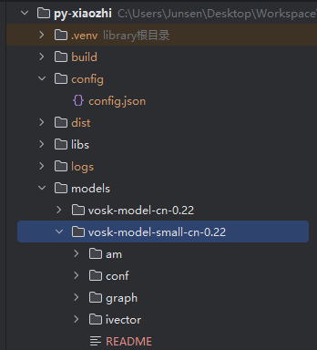

# py-xiaozhi使用文档（请认真阅读使用文档）


## 使用介绍

- 语音模式分为两种长按对话和自动对话，右下角按钮显示的是当前模式
- 长按对话：按住说话松手发送
- 自动对话：点击开始对话即可，当界面显示聆听中就表示到你说话了，说完会自行发送
- gui模式：
  - F2 键：长按说话
  - F3 键：打断对话
- cli模式
  - F2 键：按一次开始自动对话
  - F3 键：打断对话
  
## 配置说明

### 项目基础配置

#### 配置文件说明

项目使用两种配置方式：初始配置模板和运行时配置文件。

1. **初始配置模板**
   - 位置：`/src/utils/config_manager.py`
   - 作用：提供默认配置模板，首次运行时会自动生成配置文件
   - 使用场景：首次运行或需要重置配置时修改此文件

2. **运行时配置文件**
   - 位置：`/config/config.json`
   - 作用：存储实际运行时的配置信息
   - 使用场景：日常使用时修改此文件

#### 配置项说明

- 需要什么加什么配置通过config_manager去获取就行了，参考websocket或iot\things\temperature_sensor.py
- 例如获取 "MQTT_INFO"的"endpoint" , 通过这样 `config.get_config("MQTT_INFO.endpoint")`就能拿到**endpoint**

```json
{
  "CLIENT_ID": "自动生成的客户端ID",
  "DEVICE_ID": "设备MAC地址",
  "NETWORK": {
    "OTA_VERSION_URL": "OTA更新地址",
    "WEBSOCKET_URL": "WebSocket服务器地址",
    "WEBSOCKET_ACCESS_TOKEN": "访问令牌"
  },
  "MQTT_INFO": {
    "endpoint": "MQTT服务器地址",
    "client_id": "MQTT客户端ID",
    "username": "MQTT用户名",
    "password": "MQTT密码",
    "publish_topic": "发布主题",
    "subscribe_topic": "订阅主题"
  },
  "USE_WAKE_WORD": false,          // 是否启用语音唤醒
  "WAKE_WORDS": [                  // 唤醒词列表
    "小智",
    "你好小明"
  ],
  "WAKE_WORD_MODEL_PATH": "./models/vosk-model-small-cn-0.22",  // 唤醒模型路径
  "TEMPERATURE_SENSOR_MQTT_INFO": {
    "endpoint": "你的Mqtt地址",
    "port": 1883,
    "username": "admin",
    "password": "dtwin@123",
    "publish_topic": "sensors/temperature/command",
    "subscribe_topic": "sensors/temperature/device_001/state"
  },
  "CAMERA": { // 视觉配置
    "camera_index": 0,
    "frame_width": 640,
    "frame_height": 480,
    "fps": 30,
    "Local_VL_url": "https://open.bigmodel.cn/api/paas/v4/", // 智普的申请地址 https://open.bigmodel.cn/
    "VLapi_key": "你的key"
  }
  // ...可以添加任意配置
}
```

#### 配置修改指南

1. **首次使用配置**
   - 直接运行程序，系统会自动生成默认配置文件
   - 如需修改默认值，可编辑 `config_manager.py` 中的 `DEFAULT_CONFIG`

2. **更换服务器配置**
   - 打开 `/config/config.json`
   - 修改 `NETWORK.WEBSOCKET_URL` 为新的服务器地址
   - 示例：

     ```json
     "NETWORK": {
       "WEBSOCKET_URL": "ws://你的服务器地址:端口号/"
     }
     ```

3. **启用语音唤醒**
   - 修改 `USE_WAKE_WORD` 为 `true`
   - 可在 `WAKE_WORDS` 数组中添加或修改唤醒词

#### 注意事项

- 修改配置文件后需要重启程序才能生效
- WebSocket URL 必须以 `ws://` 或 `wss://` 开头
- 首次运行时会自动生成 CLIENT_ID，建议不要手动修改
- DEVICE_ID 默认使用设备MAC地址，可按需修改
- 配置文件使用 UTF-8 编码，请使用支持 UTF-8 的编辑器修改

## 启动说明

### 系统依赖安装

#### Windows

1. **安装 FFmpeg**

   ```bash
   # 方法一：使用 Scoop 安装（推荐）
   scoop install ffmpeg
   
   # 方法二：手动安装
   # 1. 访问 https://github.com/BtbN/FFmpeg-Builds/releases 下载
   # 2. 解压并将 bin 目录添加到系统 PATH
   ```

2. **Opus 音频编解码库**
   - 项目默认会自动引入 opus.dll，无需手动安装
   - 如遇问题，可将 `/libs/windows/opus.dll` 复制到以下位置之一：
     - 应用程序目录
     - `C:\Windows\System32`

#### Linux (Debian/Ubuntu)

```bash
# 安装系统依赖
sudo apt-get update
sudo apt-get install python3-pyaudio portaudio19-dev ffmpeg libopus0 libopus-dev

# 安装音量控制依赖（以下三选一）
# 1. PulseAudio 工具（推荐）
sudo apt-get install pulseaudio-utils

# 2. 或者 ALSA 工具
sudo apt-get install alsa-utils

# 3. 如果需要使用 alsamixer 方式，还需要安装 expect
sudo apt-get install alsa-utils expect


sudo apt install build-essential python3-dev
```

#### macOS

```bash
# 使用 Homebrew 安装系统依赖
brew install portaudio opus python-tk ffmpeg gfortran
brew upgrade tcl-tk
```

### Python 依赖安装

#### 方式一：使用 venv（推荐）

```bash
# 1. 创建虚拟环境
python -m venv .venv

# 2. 激活虚拟环境
# Windows
.venv\Scripts\activate
# Linux/macOS
source .venv/bin/activate

# 3. 安装依赖
# Windows/Linux
pip install -r requirements.txt -i https://mirrors.aliyun.com/pypi/simple
# macOS
pip install -r requirements_mac.txt -i https://mirrors.aliyun.com/pypi/simple
```

#### 方式二：使用 Conda

```bash
# 1. 创建 Conda 环境
conda create -n py-xiaozhi python=3.12

# 2. 激活环境
conda activate py-xiaozhi

# 3. 安装 Conda 特定依赖
conda install conda-forge::libopus
conda install conda-forge::ffmpeg

# 4. 安装 Python 依赖
# Windows/Linux
pip install -r requirements.txt -i https://mirrors.aliyun.com/pypi/simple
# macOS
pip install -r requirements_mac.txt -i https://mirrors.aliyun.com/pypi/simple
```

### 唤醒词模型

- [唤醒词模型下载](https://alphacephei.com/vosk/models)
- 下载完成后解压放至根目录/models
- 默认读取vosk-model-small-cn-0.22小模型
- 

### IoT功能说明

#### IoT模块结构

```
├── iot                          # IoT设备相关模块
│   ├── things                   # 具体设备实现目录
│   │   ├── lamp.py              # 智能灯控制实现
│   │   │   └── Lamp             # 灯设备类，提供开关、调节亮度、改变颜色等功能
│   │   ├── music_player.py      # 音乐播放器实现
│   │   │   └── MusicPlayer      # 音乐播放器类，提供播放、暂停、切换歌曲等功能
│   │   └── speaker.py           # 音量控制实现
│   │       └── Speaker          # 扬声器类，提供音量调节、静音等功能
│   ├── thing.py                 # IoT设备基类定义
│   │   ├── Thing                # 所有IoT设备的抽象基类
│   │   ├── Property             # 设备属性类，定义设备的可变状态
│   │   ├── Action               # 设备动作类，定义设备可执行的操作
│   │   └── Event                # 设备事件类，定义设备可触发的事件
│   └── thing_manager.py         # IoT设备管理器（统一管理各类设备）
│       └── ThingManager         # 单例模式实现的设备管理器，负责设备注册、查找和命令分发
```

#### Iot 状态流转

```text
                                  +----------------+
                                  |    用户语音    |
                                  |     指令      |
                                  +-------+-------+
                                          |
                                          v
                                  +-------+-------+
                                  |   语音识别    |
                                  |   (STT)      |
                                  +-------+-------+
                                          |
                                          v
                                  +-------+-------+
                                  |  LLM处理指令  |
                                  |               |
                                  +-------+-------+
                                          |
                                          v
                                  +-------+-------+
                                  | 生成物联网命令 |
                                  |               |
                                  +-------+-------+
                                          |
                                          v
                          +---------------+---------------+
                          |     Application接收IoT消息    |
                          |    _handle_iot_message()     |
                          +---------------+---------------+
                                          |
                                          v
                          +---------------+---------------+
                          |    ThingManager.invoke()     |
                          +---------------+---------------+
                                          |
           +------------------+------------------+------------------+
           |                  |                  |                  |
           v                  v                  v                  v
+----------+-------+  +-------+--------+  +------+---------+  +----+-----------+
|     Lamp         |  |    Speaker     |  |   MusicPlayer  |  |    CameraVL    |
| (控制灯设备)      |  | (控制音量设备)  |  | (播放音乐设备)  |  | (摄像头与视觉) |
+----------+-------+  +-------+--------+  +------+---------+  +----+-----------+
           |                  |                  |                  |
           |                  |                  |                  |
           |                  |                  |                  |
           |                  |                  |                  v
           |                  |                  |           +------+---------+
           |                  |                  |           |   Camera.py    |
           |                  |                  |           | (摄像头控制)    |
           |                  |                  |           +------+---------+
           |                  |                  |                  |
           |                  |                  |                  v
           |                  |                  |           +------+---------+
           |                  |                  |           |     VL.py      |
           |                  |                  |           | (视觉识别处理)  |
           |                  |                  |           +------+---------+
           |                  |                  |                  |
           +------------------+------------------+------------------+
                                          |
                                          v
                          +---------------+---------------+
                          |        执行设备操作           |
                          +---------------+---------------+
                                          |
                                          v
                          +---------------+---------------+
                          |        更新设备状态           |
                          |    _update_iot_states()      |
                          +---------------+---------------+
                                          |
                                          v
                          +---------------+---------------+
                          |     发送状态更新到服务器      |
                          |   send_iot_states(states)    |
                          +---------------+---------------+
                                          |
                                          v
                          +---------------+---------------+
                          |      服务器更新设备状态       |
                          +---------------+---------------+
                                          |
                                          v
                          +---------------+---------------+
                          |       返回执行结果给用户      |
                          |      (语音或界面反馈)        |
                          +-------------------------------+
```

#### IoT设备管理

- IoT模块采用灵活的多协议通信架构：
  - MQTT协议：用于与标准物联网设备通信，如智能灯、空调等
  - HTTP协议：用于与Web服务交互，如获取在线音乐、调用多模态AI模型等
  - 可扩展支持其他协议：如WebSocket、TCP等
- 支持自动发现和管理IoT设备
- 可通过语音命令控制IoT设备，例如：
  - "查看当前物联网设备"
  - "打开客厅的灯"
  - "关闭空调"
  - "设置温度为26度"
  - "打开摄像头"
  - "关闭摄像头"
  - "识别画面"

#### 添加新的IoT设备

1. 在`src/iot/things`目录下创建新的设备类
2. 继承`Thing`基类并实现必要方法
3. 在`thing_manager.py`中注册新设备

### 注意事项

1. 确保相应的服务器配置正确且可访问：
   - MQTT服务器配置（用于物联网设备）
   - API接口地址（用于HTTP服务）
2. 不同协议的设备/服务需实现对应的连接和通信逻辑
3. 建议为每个新增设备/服务添加基本的错误处理和重连机制
4. 可以通过扩展Thing基类来支持新的通信协议
5. 在添加新设备时，建议先进行通信测试，确保连接稳定

#### 在线音乐配置

- 接入在线音源了，无需自行配置默认可用

### 运行模式说明

#### GUI 模式运行（默认）

```bash
python main.py
```

#### CLI模式运行

```bash
python main.py --mode cli
```

#### 构建打包

使用PyInstaller打包为可执行文件：

```bash
# Windows
python scripts/build.py

# macOS
python scripts/build.py

# Linux
python scripts/build.py
```

### 注意事项

1. 建议使用 Python 3.9.13+ 版本，推荐 3.12
2. Windows 用户无需手动安装 opus.dll，项目会自动处理
3. 使用 Conda 环境时必须安装 ffmpeg 和 Opus
4. 使用 Conda 环境时请勿和esp32-server共用同一个Conda环境，因为服务端websocket依赖版本高于本项目
5. 建议使用国内镜像源安装依赖，可以提高下载速度
6. macOS 用户需使用专门的 requirements_mac.txt
7. 确保系统依赖安装完成后再安装 Python 依赖
8. 如若使用xiaozhi-esp32-server作为服务端该项目只能自动对话才有反应
9. esp32-server视频部署教程 [新版！小智ai服务端本地部署完整教程，支持DeepSeek接入](https://www.bilibili.com/video/BV1GvQWYZEd2/?share_source=copy_web&vd_source=86370b0cff2da3ab6e3d26eb1cab13d3)
10. 音量控制功能需要安装特定依赖，程序会在启动时自动检查并提示缺少的依赖

### 音量控制功能说明

本应用支持调整系统音量，根据不同操作系统需要安装不同的依赖：

1. **Windows**: 使用 pycaw 和 comtypes 控制系统音量
2. **macOS**: 使用 applescript 控制系统音量
3. **Linux**: 根据系统环境使用 pactl (PulseAudio)、wpctl (PipeWire)、amixer (ALSA) 或 alsamixer 控制音量

应用程序会在启动时自动检查这些依赖是否已安装。如果缺少依赖，将会显示相应的安装指令。

#### 音量控制使用方法

- **GUI模式**: 使用界面上的音量滑块调节音量
- **CLI模式**: 使用 `v <音量值>` 命令调节音量，例如 `v 50` 将音量设置为50%

### 状态流转图

```
                        +----------------+
                        |                |
                        v                |
+------+  唤醒词/按钮  +------------+   |   +------------+
| IDLE | -----------> | CONNECTING | --+-> | LISTENING  |
+------+              +------------+       +------------+
   ^                                            |
   |                                            | 语音识别完成
   |          +------------+                    v
   +--------- |  SPEAKING  | <-----------------+
     完成播放 +------------+
```

## 获取帮助

如果遇到问题：

1. 优先查看 docs/异常汇总.md 文档
2. 通过 GitHub Issues 提交问题
3. 通过 AI 助手寻求帮助
4. 联系作者(主页有微信)（请自备 Todesk 链接并说明来意，作者工作日晚上处理）
