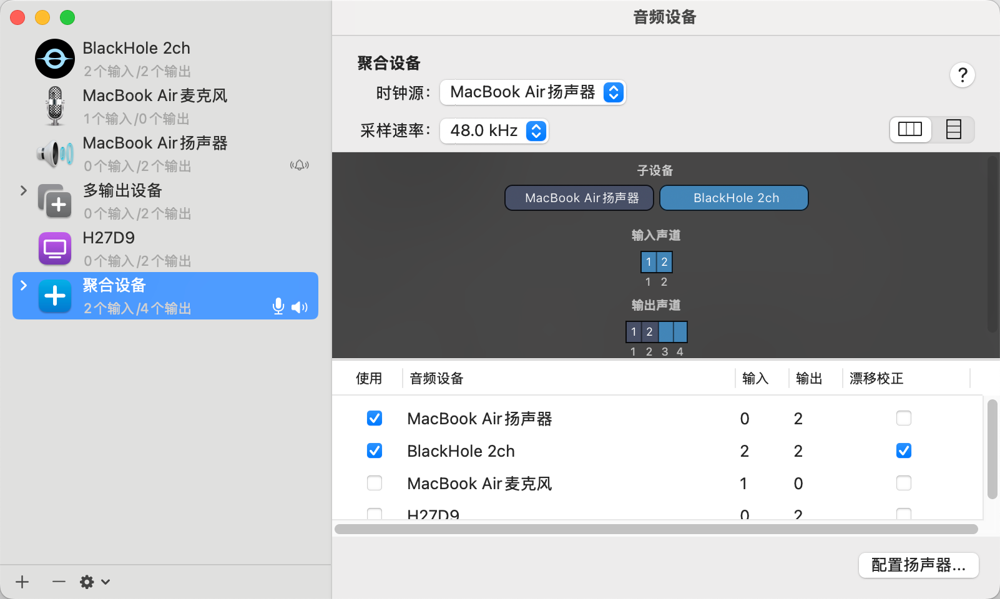
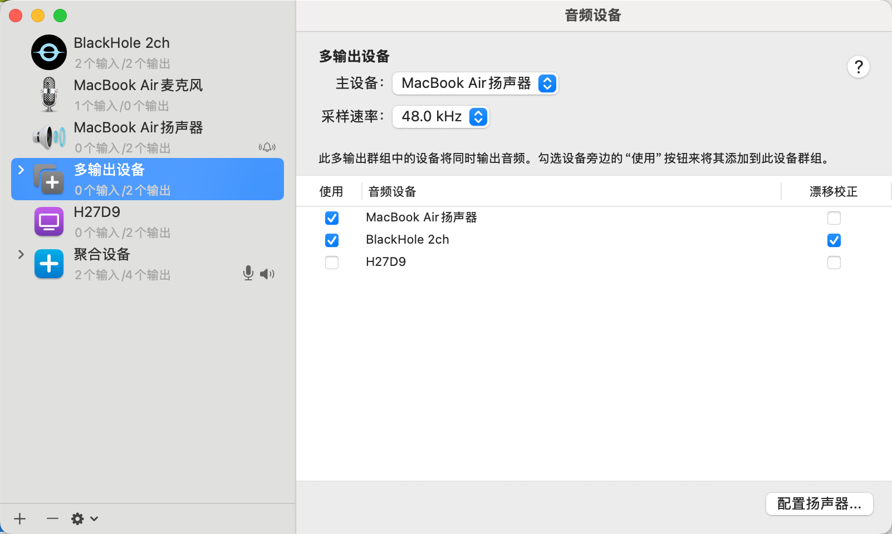

# 回声消除 (AEC) 配置指南

## 概述

回声消除（Acoustic Echo Cancellation，AEC）是语音交互中的关键技术，用于消除扬声器播放时产生的回声干扰。当系统播放音频时，麦克风会同时捕获到播放内容，导致语音识别准确性下降。

**AEC 的工作原理：**

- 捕获麦克风输入的音频信号（包含用户语音 + 回声）
- 获取扬声器播放的参考信号
- 使用算法从麦克风信号中减去预测的回声成分
- 输出干净的用户语音信号

## 平台支持架构

py-xiaozhi 采用跨平台自适应策略，根据不同操作系统的特性选择最优解决方案：

```text
                    ┌─────────────────┐
                    │   py-xiaozhi    │
                    │  AEC Processor  │
                    └─────────┬───────┘
                              │
                    ┌─────────▼───────┐
                    │  Platform Check │
                    └─┬─────┬─────┬───┘
            ┌─────────▼─┐ ┌─▼───┐ ┌▼──────────┐
            │  Windows  │ │Linux│ │   macOS   │
            │ 系统级AEC │ │PA-AEC│ │WebRTC+BH │
            └───────────┘ └─────┘ └───────────┘
                 │           │         │
            ┌────▼────┐ ┌────▼───┐ ┌───▼────┐
            │开箱即用 │ │一次配置│ │需要配置│
            └─────────┘ └────────┘ └────────┘
```

### 🪟 Windows 平台

- **方案**: 系统级驱动层AEC
- **优势**: 零配置，开箱即用
- **原理**: 音频驱动已处理回声消除
- **性能**: 最低延迟，无额外开销

### 🐧 Linux 平台

- **方案**: PulseAudio模块化AEC
- **优势**: 系统级处理，应用透明
- **原理**: module-echo-cancel + WebRTC算法
- **配置**: 一次性配置，持久生效

### 🍎 macOS 平台

- **方案**: WebRTC + BlackHole虚拟设备
- **优势**: 实时处理，效果可控
- **原理**: 应用层实时算法处理
- **配置**: 需安装虚拟音频设备

---

# 🐧 Linux 平台配置

## 系统要求

| 项目 | 要求 |
|------|------|
| **操作系统** | 基于 PulseAudio 的 Linux 发行版 |
| **测试环境** | Ubuntu 20.04+ / Fedora 35+ |
| **硬件推荐** | 外置USB麦克风 + 独立扬声器 |

> ⚠️ **硬件建议**: 笔记本内置麦克风+扬声器组合由于物理振动耦合，AEC效果有限

## 技术架构

```text
┌─────────────┐    ┌─────────────────┐    ┌──────────────┐
│ 物理麦克风  │───▶│  module-echo-   │───▶│ 虚拟设备     │
│            │    │  cancel        │    │ echoCancel_  │
└─────────────┘    └─────────────────┘    │ source       │
                           ▲               └──────┬───────┘
┌─────────────┐           │                      │
│ 扬声器输出  │───────────┘                      ▼
└─────────────┘                          ┌──────────────┐
                                         │ py-xiaozhi   │
                                         │ 音频输入     │
                                         └──────────────┘
```

## 一键配置脚本

### 下载安装

```bash
# 下载配置脚本
git clone https://github.com/W-E-A/PulseAudio-AEC-Script.git
cd PulseAudio-AEC-Script

# 设置执行权限
chmod +x setup_aec.sh uninstall_aec.sh
```

### 运行配置

```bash
# 运行安装脚本（不要使用sudo）
./setup_aec.sh
```

**配置流程:**

1. **设备检测** - 脚本扫描所有可用麦克风设备
2. **设备选择** - 选择目标麦克风（推荐USB外置麦克风）
3. **模块配置** - 自动配置PulseAudio回声消除模块
4. **服务重启** - 重启音频服务使配置生效

### 系统设置

配置完成后：

1. 打开系统"声音"设置
2. **输入设备**: 选择包含 `echo cancellation` 的虚拟麦克风
3. **输出设备**: 选择包含 `echo cancellation` 的虚拟扬声器

### 效果验证


### 卸载配置

```bash
# 恢复原始配置
./uninstall_aec.sh
```

## 故障排除

### 常见问题

**Q1: 脚本运行后找不到 echo cancellation 设备**

解决方案:

```bash
# 检查PulseAudio状态
pactl list sources short
pactl list sinks short

# 重启音频服务
pulseaudio -k
```

**Q2: 内置麦克风AEC效果不佳**

原因分析:

- 物理振动耦合: 扬声器振动传导至内置麦克风
- 设备兼容性: 某些内置设备不支持AEC模块

建议方案:

- 使用外置USB麦克风 + 独立扬声器
- 物理隔离振动源

**Q3: 配置后音频延迟增加**

调优方案:

```bash
# 检查缓冲区设置
pactl list sources | grep -A10 "echo-cancel"

# 调整延迟参数（可选）
# 编辑 ~/.config/pulse/default.pa
# 添加: load-module module-echo-cancel aec_args='"frame_size_ms=8"'
```

---

# 🍎 macOS 平台配置

## 系统要求

| 项目 | 要求 |
|------|------|
| **操作系统** | macOS 10.15+ |
| **虚拟音频** | BlackHole 2ch |
| **Python依赖** | webrtc-audio-processing |

## 技术架构

```text
┌─────────────┐    ┌─────────────────┐    ┌──────────────┐
│ 物理麦克风  │───▶│  WebRTC AEC     │───▶│ py-xiaozhi   │
│            │    │  实时处理       │    │ 音频输入     │
└─────────────┘    └─────────┬───────┘    └──────────────┘
                             ▲
              ┌──────────────▼───────────────┐
              │        聚合设备/多输出        │
              └──┬─────────────────────┬─────┘
┌─────────────▼─┐                    ┌▼──────────────┐
│ 物理扬声器    │                    │ BlackHole 2ch │
│ (用户听音)    │                    │ (参考信号)    │
└───────────────┘                    └───────────────┘
```

## 安装 BlackHole

### 方式一：Homebrew 安装（推荐）

```bash
# 安装 BlackHole
brew install blackhole-2ch
```

### 方式二：手动安装

1. 访问 [BlackHole 官方页面](https://github.com/ExistentialAudio/BlackHole)
2. 下载 BlackHole 2ch 安装包
3. 运行安装程序并授权

## 音频设备配置

### 步骤1：创建聚合设备

> 如果不行就创建多设备，还是勾选扬声器和blackhole，经查阅资料和ai都是推荐创建聚合设备，但是我实际测试，创建多设备才能正确使用webrtc消除回声

1. 打开"应用程序" → "实用工具" → "音频 MIDI 设置"
2. 点击左下角"+"号 → "创建聚合设备"
3. 配置聚合设备：
   - ✅ MacBook Air 扬声器（主设备）
   - ✅ BlackHole 2ch
   - 采样率：48.0 kHz




> 💡 **配置说明**: 聚合设备确保音频同步输出到扬声器和BlackHole，为AEC提供精确的时间对齐

### 步骤2：系统音频设置

1. 打开"系统偏好设置" → "声音"
2. **输出**: 选择刚创建的聚合设备
3. **输入**: 保持默认麦克风设备


> ⚠️ **音量控制限制**: 聚合设备无法直接调节系统音量，可在音频MIDI设置中调整各子设备音量

### 步骤3：验证设备可用性

```bash
# 检查 BlackHole 设备是否被识别
python3 -c "
import sounddevice as sd
devices = sd.query_devices()
for i, device in enumerate(devices):
    if 'blackhole' in device['name'].lower():
        print(f'[{i}] {device[\"name\"]} - {device[\"max_input_channels\"]}ch输入')
"
```

## 应用自动配置

py-xiaozhi 启动时自动执行：

1. **设备检测** - 扫描并识别 BlackHole 2ch 设备
2. **AEC初始化** - 创建 WebRTC 音频处理实例
3. **参考信号流** - 建立 BlackHole 音频捕获流
4. **实时处理** - 启动麦克风音频的回声消除处理

### 配置验证

```python
# 检查 AEC 状态
from src.audio_codecs.audio_codec import AudioCodec

codec = AudioCodec()
await codec.initialize()

# 获取 AEC 状态
status = codec.get_aec_status()
print(f"AEC启用: {status['enabled']}")
print(f"参考信号可用: {status['reference_available']}")
```

## 故障排除

### 常见问题

#### Q1: BlackHole 设备未找到

解决方案:

```bash
# 重新安装 BlackHole
brew reinstall blackhole-2ch

# 重启 CoreAudio 服务
sudo launchctl kickstart -kp system/com.apple.audio.coreaudiod
```

#### Q2: 聚合设备无法创建

检查项:

- 确认 BlackHole 已正确安装
- 重启"音频 MIDI 设置"应用
- 检查系统音频权限设置

#### Q3: AEC 效果不佳

优化建议:

- 确保使用聚合设备而非多输出设备
- 调整麦克风与扬声器的物理距离
- 检查环境噪音水平

#### Q4: 音频延迟过高

调优方案:

- 降低音频缓冲区大小
- 使用有线音频设备替代蓝牙
- 关闭其他音频处理软件

---

# 🧪 配置验证与测试

## 状态检查

### 通用状态验证

```python
# 启动 py-xiaozhi 后检查 AEC 状态
from src.audio_codecs.audio_codec import AudioCodec

codec = AudioCodec()
await codec.initialize()

# 获取详细状态信息
status = codec.get_aec_status()
print(f"AEC启用状态: {status['enabled']}")
print(f"平台类型: {status.get('aec_type', 'unknown')}")
print(f"描述: {status.get('description', 'N/A')}")
```

### 平台特定检查

#### Windows

```bash
# 检查音频驱动AEC支持
# 在设备管理器中查看音频设备属性
```

#### Linux

```bash
# 验证 PulseAudio AEC 模块
pactl list sources | grep -i "echo"
pactl list sinks | grep -i "echo"

# 检查模块加载状态
pactl list modules | grep echo-cancel
```

#### macOS

```bash
# 验证 BlackHole 设备
system_profiler SPAudioDataType | grep -i blackhole

# 检查聚合设备
# 在音频MIDI设置中确认设备状态
```

## 功能测试

- 理论上在config.json开启aec后, 选择自动对话，不会自言自语就是正常了，linux和mac需要配置,windows我找了几个人测试都是正常的系统底层已经处理了

## 参考资源

### 官方文档

- [PulseAudio AEC Script](https://github.com/W-E-A/PulseAudio-AEC-Script) - Linux 自动配置脚本
- [BlackHole 官方仓库](https://github.com/ExistentialAudio/BlackHole) - macOS 虚拟音频设备
- [WebRTC Audio Processing](https://webrtc.googlesource.com/src/+/refs/heads/master/modules/audio_processing/) - 算法实现文档
